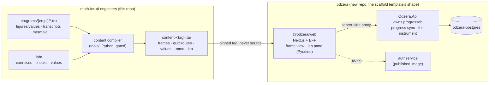

# The learning application: the book and its exercises in one place

A proposal, measured against `konradcinkusz/architecture-standards` at `82c756d`
and against the book at the tree this note was written on. It answers two
questions the author put in one afternoon, in this order:

1. *What about a second book, a PDF of exercises to solve on a computer, open
   beside the first one on a split screen?* Answered in §2 and §7: yes to the
   exercises, no to the second PDF, and the exercise engine is built and
   verified under `lab/`.
2. *The book is not the most optimal medium. Could an application encapsulate
   the book and the exercises, built to my standards?* The rest of this note.

The standards say where a finding goes: *"Findings, reviews and migration plans
are written into the target repo's own `docs/architecture/`"* (`AGENTS.md` §A).
The application is greenfield, so its own record \dash{} `docs/architecture/`,
`docs/adr/`, the deviation register \dash{} will live in its own repository,
initialised by `/init-generic-template` on an empty repo, as
`INIT-GENERIC-TEMPLATE.md` §2 requires. This note is the case for the decision
and the plan, kept where the book keeps its reasoning. The decisions in §6 are
written as the ADRs they will become.

**Every number here is measured**, and says by what. The book's own figures are
quoted from its ledgers; the content figures come from
`lab/tools/content_probe.py`, run over `programs/en` with the book's own
tokeniser; the standards are quoted with the file and section.

---

## 1. The book as a medium, reviewed

The content is not under review. Forty-seven programs, both editions, every
number computed, every gate green: the mathematics and the pedagogy are the
assets an application inherits, and nothing below proposes changing a frame.
What is under review is the **medium** \dash{} a programmed-learning method
delivered as a PDF \dash{} and the review finds four things, each of which the
book's own records document better than an outside reader could.

### 1.1 The method rests on a discipline the medium cannot enforce

The whole method is one mechanism: a frame ends by asking, the answer is at the
top of the next frame, and the reader covers it, writes, and then uncovers.
The front matter says so and says what breaks: *"This is the one rule that is
not negotiable. Break it and the book degenerates into a mediocre collection of
worked examples \dots You will be tempted to break it in exactly the frames
where it matters most, which are the ones where you are not sure."*

A page cannot hold the reader to that. It can only ask. The evidence the book
itself cites \dash{} retrieval practice beats rereading, and errorful
generation beats study without the error \dash{} is evidence about readers who
actually produced the answer first, and a PDF has no way to know whether this
one did. **The single largest gain available to the book is a medium in which
the next frame is not visible until the reader has committed an answer.** That
is one line of product design and it is the reason to build anything at all.

### 1.2 The page fights the method, and most of the book's engineering is spent on the fight

`CLAUDE.md` is, by volume, a record of page-level defects: the orphaned cue (a
question on one page and *Next frame.* alone on the next), the orphan tail, the
stranded opener, the stranded heading. The ledgers as they stand:

| | measured |
|---|---|
| orphan-tail pages across the four builds | 94 |
| rounds of lengthening to clear the cues of one program (P32) | 7 |
| rounds for one part's elicitation pass (Part III) | 6 |
| formats compiled per change, because each paginates differently | 4 |
| pages, `main-en` / `main-pl` / `main-en-a4` / `main-pl-a4` | 1435 / 1460 / 1200 / 1212 |

Every one of those is a property of a *page break*. The book's rule *no
instruction may depend on where the page happens to break* exists because the
same sentence was true in English and false in Polish; the cue check is a hard
gate on the author's machine and a warning in CI because two TeX installations
paginate differently and *"trimming the line CI names fixes CI and moves the
defect here."* A rendered frame has no page. The entire class \dash{} and the
random walk of lengthening frames in two languages to move a cue across a
boundary \dash{} does not exist in a medium that lays one frame out at a time.
None of it is wasted for the PDF, which remains the citable artefact; all of it
is a cost the application does not pay.

### 1.3 The numbers are machine-readable and the page can only print them

The book's first rule is *every number is computed, not remembered*: 1673
values written by scripts under `code/`, 88 console transcripts, 300 Mermaid
sources, all committed and drift-gated. A PDF prints them. A reader who wants
to *do* what Program P1 says \dash{} *a claim about what the machine stores is
settled by asking it* \dash{} has to leave the book, open an editor, and
reconstruct the experiment; there is no path from the page to the machine.
That is the gap the author's first question was about, and §2 closes it.

### 1.4 The book's return index is navigation by thumbing

The Quiz routes each question to the frames that teach it (370 routes), the
Summary's brackets send each item back (756 items), and the outcomes name
their frames. In a PDF that index is followed by turning pages. Every one of
them is a link in an application, and the parity discipline \dash{} both
editions frame-for-frame, gated on every build \dash{} means the link can
cross the language boundary: the same frame, in the other language, one
toggle away. No PDF can do that.

### 1.5 The book cannot measure itself

Its most honest line is the ledger at the top of `CLAUDE.md`: **80/80
validation: NOT ESTABLISHED**, *"this is the one ledger that is a claim rather
than a count, and it must not quietly go away."* Stroud validated his programs
above 80/80 before publication; this book has not been read by anybody. A PDF
has no instrument. An application has one \dash{} which frames elicit a wrong
answer and how often, which traps fire, which exercise checks fail on the
first run \dash{} and that instrument is the only route to the ledger the book
says it may not claim. It is also the one place the standards constrain hardest
(§6.4), for good reason.

### 1.6 What not to change

The frames, the elicitation, the computed numbers, the parity between the
editions, the notation contract. Those are what make the book compilable into
an application at all, and §4 measures how far they already go.

---

## 2. The exercises: what was asked, what was built, and what was not

**The opinion, in one paragraph.** Exercises solved beside the book are the
right idea for exactly the claims the book already labels *computed, not
remembered*, and the wrong idea for the derivations, which stay in the
notebook. The danger is the reverse of the book's: on a page the risk is that
the reader reads the answer instead of producing it; on a computer the risk is
that the *machine* produces the answer and the reader watches. So an exercise
has to keep the pencil in the loop \dash{} predict on paper, then implement,
then let the machine judge \dash{} and the machine must judge against the
book's own numbers, so the exercise cannot drift from the page it belongs to.

**What was built** is under `lab/`, and it is presentation-independent on
purpose:

- `lab/exercises/p01_floating_point.py` \dash{} seven exercises for Program P1,
  each a function stub whose docstring names the frames it rests on;
- `lab/tests/test_p01.py` \dash{} thirteen checks, plain functions and plain
  asserts, every expected value read from `figures/values/p01.tex` through
  `lab/tests/labkit.py`, never typed; a failure names the frames to re-read;
- `lab/check.py` \dash{} a runner needing nothing but Python, so the loop costs
  a reader no installation; the same checks run under pytest;
- `lab/tools/labcheck.py` \dash{} the gates: the reference solutions pass every
  check and the untouched stubs pass none (measured: 13 and 13); the exercise
  and solution files agree; and `--guard` proves from the diff that nothing
  the book's build reads was touched.

Program P1 was chosen because its own method is the lab's: read the bits with
`struct`, find the swamping threshold by bisection instead of being told it,
multiply a coin until the format gives up. Every exercise is one of P1's own
measurements, asked of the reader before they read it.

**What was not built is the second PDF.** A screen-sized LaTeX document on the
KDP pattern was designed and its one novel mechanism probed \dash{}
`listings` range markers printing each exercise from the reader's own file, so
the page and the file could not disagree. It works. It was not written, because
the author's second question made it the wrong presentation: a PDF beside a
PDF still cannot hide the next frame, still paginates, and would be a second
copy of the exercises to keep true. The engine is the part that survives the
change of presentation, and it is the part that was verified.

---

## 3. What the application is

One sentence: **the book, one frame at a time, with the next frame hidden
until the reader answers; the exercises beside the frames that name them, run
in the browser against the book's own numbers; and an instrument that measures
the book and never the reader.**

Three properties decide everything else:

- **The reader's loop needs no server.** Reading, answering, revealing,
  running a check: all of it is content plus Pyodide in the browser. The
  application must work with zero credentials and zero backends (P8's literal
  test: *"`git clone && dotnet run` with zero cloud credentials must produce a
  working system with reduced features"*), and *reduced* here means *no sync*,
  not *no book*.
- **The content is a pinned artefact of the book, never its source.** The book
  releases a content bundle on its `v*` tag; the application pins the tag, the
  way `SHARED-SERVICE-REUSE.md` §2 pins an image (*"pinned, never `:latest`"*).
  The book's own page numbers are irrelevant to it; its frame numbers are the
  contract, and parity already guarantees them across the two languages.
- **The instrument measures artefacts, never people** (`METRIC-ETHICS.md` §5:
  *"The unit of evaluation is the artifact, never the person"*). A frame, an
  attempt, a check run. There is no per-learner score, and there is no view in
  which one could appear (§6.4).

---

## 4. The content compiler, and the measurement that says it is a week rather than a year

`P11 \dash{} Anti-corruption at the edge`: *"External dialects are normalized
into one internal model at the boundary, once. Nothing downstream knows there
was more than one dialect."* The book's LaTeX is the external dialect. It is
normalised once, in the book's repository, by a compiler that emits a content
model; the application never sees LaTeX.

**Why the compiler lives in the book's repository and is Python.** The book's
tokeniser already exists (`tools/parity.py`), it is Python, it runs over every
program on every build, and the book's CI can gate the compiler the way it
gates everything else: every frame compiles, every `\val{}` resolves, no
unknown macro. Putting the compiler in the application would mean a second
LaTeX parser in a second language, unreviewed by the checks that know the
dialect. The standards' rule on Python (§6.1) governs the *application's*
repository; the book's tools are Python already and stay so.

**The measurement.** `lab/tools/content_probe.py` splits every program at its
frames with `parity.tokenise` and reports what a compiler would have to emit.
Run over `programs/en` on this tree:

| | |
|---|---|
| programs / sections / frames | 47 / 275 / 1866 |
| frames opening with an answer (`\ans` or `ansblock`) | 1030 |
| frames ending with the next-frame cue | 1030 |
| admonition boxes: trap / note / aibox / warning / rigour / notation | 166 / 96 / 85 / 40 / 36 / 12 |
| maths spans | 13 892 |
| distinct `\val{}` keys referenced | 1702 |
| figures (Mermaid sources, per edition) / transcripts (per edition) | 150 / 44 |
| Quiz items with a route back into the frames | 370 / 370 |
| Test exercises / Further problems | 395 / 376 |

Two of those rows are the argument. **1030 and 1030**: in every program, frame
$n$ ends with a cue exactly when frame $n+1$ opens with an answer \dash{} zero
mismatches, which is parity's C16 seen from the other side \dash{} so the
question/answer/cue structure the application needs is not inferred, it is
already the file. And **1702 keys**: every number is a key the compiler can
resolve per language from `figures/values/`, so the two editions of a frame
differ in prose and in nothing else.

**What the compiler emits.** Per program and per language: sections; frames as
`{n, question, answer, cue, modes, boxes, maths, vals, figs}`; quiz items with
their routes; outcomes and Summary items with their frame ranges; the Appendix
A answers; transcripts as text; diagrams as `.mmd` source, which the
application renders itself. Maths is emitted for KaTeX with a macro table per
language: the notation contract (`\tg`, `\gcdop`, `\intcc`, `\Var`, `\dash`,
`\enquote`, `\num`) *is* the internationalisation table, and it is the same
72-macro catalogue `lang/{en,pl}.tex` already carry and parity's C3 already
compares. `\num` and `\val` are resolved to per-language text at compile time,
because the decimal comma is the most visible feature of the Polish edition and
it is not KaTeX's business.

**What the compiler refuses.** An unknown macro, an unresolved `\val`, a frame
whose cue and successor disagree, a maths span KaTeX cannot render (a render
test, in the book's CI, with `katex` on Node). It refuses rather than degrades,
because the book's own record is that *"every graceful degradation in this
preamble is a place where a defect can look intentional"* \dash{} ten of its
twelve transcripts once went nine programs without reaching a page behind a
grey marker that read like a decision.

**What is open, and labelled as judgement until measured:** how many of the
13 892 maths spans KaTeX renders unchanged. The book uses `amsmath`, `\text`,
`\frac`, `\sum`, `\lVert`, custom operators via `\DeclareMathOperator`; KaTeX
covers all of those; the render test is what turns that sentence into a number.

### 4.1 Measured, September 2026: the compiler is written and the number is zero

`lab/tools/content_compile.py` and `lab/tools/content_katex.js`, gated by
`.github/workflows/content.yml`. **21 714 of 21 714 maths spans render under
KaTeX in strict mode**, so the paragraph above is now a measurement and the
answer is that nothing fails.

**Read the count carefully rather than against the 13 892 above**: the probe
counts `MATH` tokens in frames, and this counts `$...$` and `$$...$$` in the
finished bundle \dash{} which includes answers, section titles and route
labels, and splits a display the probe counted once. The two are different
quantities and neither is wrong.

**Three things in the plan above did not survive contact, and each is worth
more than the sentence it replaces.**

- **The frame shape is not `{n, question, answer, cue, modes, boxes, maths,
  vals, figs}`.** ab-ove owns the schema (`content-schema.v1.json`,
  ADR-0014), and its step is `{n, kind, body}` with `answer`, `cue`,
  `section` and `check` optional. Issue #239 §6 settles the conflict in that
  repository's favour \dash{} *target that schema, do not invent a second
  one* \dash{} so the richer shape sketched here is what a v2 might carry and
  is not what ships.
- **Version 1 carries no figures and no transcripts at all.** ADR-0014 says
  so by name. 300 figures and 88 transcripts are therefore removed from the
  bodies and **counted on every run**, which is the orphan-tail ledger's
  treatment and not a silent drop.
- **The KaTeX macro table is 31 entries, not 72.** Measured across every
  maths span in the book: 137 distinct macros appear inside maths, 106 of
  them KaTeX's own. Five of the 31 differ between the editions, which is the
  whole of what "the notation contract IS the i18n table" turns out to cost.

**And one genuine finding for ab-ove**, which is what ADR-0014 predicted a
first real compiler would produce: five frames per edition \dash{} the same
five in both \dash{} have no content but their answer, and a v1 step requires
a non-empty `body`. They ship split at a boundary the source already has, and
the schema question goes upstream.

---

## 5. The architecture, measured against the constitution

The application is the scaffold template's own smallest system \dash{}
*"one system, five projects, one frontend, three Fly apps \dots deliberately the
smallest system that exercises every principle"* (`INIT-GENERIC-TEMPLATE.md`
§3) \dash{} with the one service it allows and the one it forbids inventing.

**The argument and the derived names** (`INIT` §1 requires them echoed before
anything is written). The slug is `odzera`: the name `notes/01-curriculum.md`
§18 already reserved for the companion library, and the application is that
library's front. `^[a-z][a-z0-9-]*$` holds.

| Derived | Value |
|---|---|
| System slug | `odzera` |
| .NET root namespace and solution | `Odzera` |
| Projects | `Odzera.AppHost`, `Odzera.ServiceDefaults`, `Odzera.Contracts`, `Odzera.Api`, `Odzera.Api.Tests` |
| Frontend workspace | `web/`, npm scope `@odzera` |
| Fly apps | `odzera-api-<env>`, `odzera-web-<env>`, `odzera-authservice-<env>` |
| Fly Postgres app / database | `odzera-postgres` / `progressdb` |
| Container images | `ghcr.io/konradcinkusz/odzera-api`, `ghcr.io/konradcinkusz/odzera-web` |
| Config prefix | `Odzera__…` |

**The bounded contexts, drawn around data cohesion** (P3: *"Bounded contexts
are drawn around data cohesion, not around nouns"*). There are two kinds of
data and they have nothing in common: **content**, immutable per book tag,
identical for every reader; and **progress**, per reader, mutable, small.
Content is a static artefact and needs no database and no service \dash{} the
web app serves it from the pinned bundle. Progress is the one service:
`Odzera.Api` owns `progressdb`, and owns the instrument's aggregate tables
beside it because they are derived from the same writes. That is one service,
one database, no second service invented (`INIT` §12).

**Principle by principle.**

| | The application's answer |
|---|---|
| P1 AppHost | `Odzera.AppHost` declares Postgres, the API and the web app with `WithReference`, `WaitFor`, `WithHttpHealthCheck`; development only |
| P2 kernel | `Odzera.ServiceDefaults`, the eight concerns and nothing else; the ~800-line CI ceiling and the no-entity architecture test from the first commit |
| P3 / P4 | `Odzera.Api` owns `progressdb`; `DATABASE_PROVIDER` selects Postgres and falls back to InMemory; schema by `MigrateAsync` in a hosted service. Progress is *"a lost transaction"*-shaped, so it takes the ORM-managed schema and not the snapshot pattern (`STATE-SNAPSHOT-PERSISTENCE.md` §6 says which) |
| P5 | No user store, no token minting; RS256 validated against authservice's JWKS; gitleaks pre-commit and CI |
| P6 / P7 | Multi-stage Dockerfiles on `:8080` and `:3000`; four Fly apps, below |
| P8 | The whole reader loop works with no backend at all; `/health` reports `progress`, `auth` and `instrument` as degraded when they are |
| P9 / P10 | `Program.cs` a manifest; the instrument's analysers are `IFrameOutcomeAnalyzer` implementations registered in DI |
| P11 | The content compiler, §4; and one internal `Frame` model, whatever the LaTeX said |
| P12 | Tag-driven `flyio.yml`, change detection against the previous tag, build once to GHCR, ordered deploy, `success \|\| skipped` gates |
| P13 | xUnit on the API; Playwright from the first commit with one real journey (§7); the book's own `lab.yml` proves the checks |
| P14 | `docs/architecture/00-ARCHITECTURE.md` referencing the constitution, the deviation register with dated rows, the ADRs of §6, `docs/ux/UI-UX.md` |
| P15 | OTLP from the first commit; health probes filtered from traces |

**The frontend** (`FRONTEND-BFF.md`): *"The browser talks only to the
frontend's own origin"* (§1). Runtime configuration through `GET /api/config`,
no `NEXT_PUBLIC_*` for addresses (§2); sessions as HttpOnly cookies set by the
app's own BFF route (§3); middleware that *verifies* against the JWKS and is
UX, not the boundary (§4); one catch-all proxy `/api/proxy/[...path]` with the
candidate ladder (§5); one pnpm workspace from the first commit (§7). Pyodide
and the content bundle are served from the app's own origin, so the same-origin
rule holds for the lab pane as well; nothing is fetched from a CDN at run time.

**Fly topology** (`FLY-IO-DEPLOYMENT.md` §4--§7; `INIT` §7):

| App | Shape | `min_machines_running` | Why |
|---|---|---|---|
| `odzera-postgres` | database | n/a | No public listener; `.internal:5432` over 6PN; `PGDATA` in a subdirectory of the mount |
| `odzera-authservice-<env>` | HTTP | **1** | Every validator fetches its JWKS in-request |
| `odzera-api-<env>` | HTTP | **1** | The web app's server side calls it in-request |
| `odzera-web-<env>` | frontend | 0 | Entered only from a browser; a cold start is a slow first page |

`flyio/SECRETS.md` and `flyio/INFRASTRUCTURE-ANALYSIS.md` answer the four cost
questions; at this size the honest answer to *what runs when nothing is
happening* is two pinned machines and a Postgres, and the reader loop costs
nothing because it never reaches them.

**The open-source shape.** `PRIVATE-CLOUD-DELIVERY.md` §9: *"images published
to a public registry, and a compose file anybody can curl and run \dots Use it
for the open-source edition."* The book is CC BY-NC-SA and MIT; the
application is MIT (`OPEN-SOURCE-RELEASE.md` §3: *"MIT is the estate's default
absent a specific reason otherwise"*), its images public on GHCR \dash{}
remembering that *"a registry package is private by default on first push"*
\dash{} and a `compose.yml` that runs web, API and Postgres without Fly at all.
That is not a deviation from P7: Fly is the deployment; compose is the
distribution.

**The seven workflows** (`INIT` §8), wired on the first commit: `ci.yml`,
`secret-scan.yml`, `codeql.yml`, `flyio.yml`, `flyio-scale.yml`,
`flyio-destroy.yml`, `build-overview-pdf.yml`. And the constitution's own
language rule, which binds a bilingual project precisely: *"English for
anything needed to build or deploy"* (§2). The content is bilingual; the
repository is not.

---

## 6. The decisions that are ADRs and not defaults

`INIT` §1: three things are *"asked once and recorded as an ADR \dash{} never
guessed silently"*, and §12 adds a fourth class: *"you are asked for a
framework other than the ones the standards evidence \dots a different choice
is a recorded decision in `docs/adr/`, not a silent substitution."* This
application has four, and one non-goal that would become a fifth.

### 6.1 The exercise checks are Python, and they run in the browser

**Decision.** The exercises and their checks are Python files from the book's
`lab/`, executed in the reader's browser by Pyodide. No Python runs on any
server of the application; no Python source lives in the application's
repository \dash{} it arrives inside the pinned content bundle.

**Why it is a deviation.** *"Python is nowhere in the standards"*: no evidenced
stack, runner or packaging rule, so `INIT` §12 applies.

**Why it is right anyway.** The book's numbers are produced by Python, its
transcripts are Python sessions, and its readers are AI engineers whose
language is Python; a check written in anything else would be checking a
translation. Executing the reader's code in the browser is what makes P8 hold
(no backend, no credentials) and what removes the security problem a
server-side runner creates: untrusted code never leaves the machine that wrote
it, so there is no sandbox to secure and no machine to pay for. The engine is
already verified in both directions (§2).

**What executes them in CI**, because `TESTING-STRATEGY.md` §9 forbids a test
config nothing runs: the book's `.github/workflows/lab.yml` runs
`labcheck.py --all` on every change to `lab/`; the application's `ci.yml` runs
one Playwright journey that loads Lab P1, pastes the reference solution of one
exercise, presses *Check* and asserts the pass \dash{} so the Pyodide path is
executed, not assumed.

**Exit condition.** If the standards ever evidence a browser-side runtime, this
ADR's deviation row closes; the decision itself does not need to change.

### 6.2 The system has users, and is fully usable without an account

**Decision.** Identity is `konradcinkusz/authservice`, consumed as a published
image, exactly as `INIT` §1 says for a system with users. **And** the reader
loop \dash{} reading, answering, revealing, checking \dash{} works with no
account: progress is kept in the browser, and an account adds
synchronisation across devices and nothing else. That is P8 applied to auth:
an optional dependency degrades a feature, it does not fail the product.

**The obligation it creates.** `TESTING-STRATEGY.md` §7 case 4 names
*"client-side-only data (local storage without server backup), where a bug is
permanent data loss"* as something only a human can test. So the anonymous
path carries an export (a file the reader can save) and a manual test in the
release checklist, and the sync path is where the API earns its existence.

### 6.3 Region and registry

**Decision.** GHCR, the constitution's own default (§2: *"portable and free at
this scale"*). Region `waw`, because the author and the Polish edition's
readers are there; recorded as a decision because the guides show both `waw`
and `fra` and *"a region is expensive to change once volumes exist"*.
Dependabot declared for every ecosystem with `open-pull-requests-limit: 0`,
per `INIT` §4, with the repository's security-update setting named in the same
ADR and *"a maintainer who triages"* as the trigger for turning it on.

### 6.4 What the instrument may measure

This is the decision the book most needs and the one the standards constrain
hardest, and the two agree.

**Anti-goals, stated first** (`METRIC-ETHICS.md` rule 1: at the top of the
README, *"enforced by an architectural absence \dash{} a view that does not
exist \dash{} rather than by policy alone"*):

- **`odzera` measures the book, never the reader.** There is no per-reader
  score, no ranking, no comparison between readers, and no table from which one
  could be built: outcomes are recorded against a *frame*, an *attempt* and a
  *check run*, with the reader's identity absent from the aggregate store.
- **A reader's own progress is theirs.** It is shown to them, exported on
  request, and deleted on request; it is not the instrument's input.

**What is measured**, and why it is the book's 80/80 ledger made possible:

| artefact | measure | counter-measure (rule 2) |
|---|---|---|
| a frame | share of first attempts that matched the answer | share of readers who revealed without answering |
| a trap frame | share of first attempts that gave the trap's wrong answer | share that skipped the frame |
| an exercise | share of check runs that pass; the failing checks by name | median runs before the first pass |
| a Quiz | per-question miss rate; which routes were followed | share who skipped the Quiz entirely |

**No number leaves without its confidence** (rule 3). Every rate carries an
interval, and the arithmetic is the book's own: Program P27 derives the
standard error of a proportion and says how many items a one-point difference
needs, and Program P34 says why an evaluation set is a sample. An instrument
built on the book that reported a rate without its interval would fail the
book's own Test exercises.

**Heuristics about people are report-only and live outside the engine** (rule
4). Anything that infers a *state* of the reader \dash{} confusion,
frustration, time-on-frame as attention \dash{} is not computed. If a future
version wants it, it is a separate analyser that emits a report and enters no
composite, which is the rule's exact shape.

**Consent.** The instrument is opt-in, versioned per `IDENTITY-AND-ACCOUNTS.md`'s
consent model, and the anonymous reader contributes nothing unless they say
so. A book that has never been read gains more from a hundred readers who
agreed than from a thousand who did not know.

### 6.5 Non-goal: no language model in the loop

The obvious feature \dash{} an assistant that explains a wrong answer \dash{} is
not in this proposal, for two reasons. The book already has the hint mechanism
the standards would want: a failed check *names the frames*, and the frames
are where the explanation lives; an assistant that re-explained them would be
the *"re-derive rather than read"* failure the standards name in their first
sentence, applied to the reader. And the moment one exists, `AI-EVALS.md`
applies in full: a behaviour spec before the prompt, a scenario set with an
adversarial class (*"a suite with no adversarial class is testing the demo,
not the product"*), a calibrated judge, and a 100 per cent hard-constraint gate.
That is a project, not a feature, and it is recorded here as a non-goal so
that adding it later is a decision.

---

## 7. What exists, and the plan

**Exists, verified, in this repository:** the exercise engine (§2), its gates
and workflow, and the content probe (§4). Nothing the book's build reads was
touched; `labcheck.py --guard origin/main` says so.

**Phase 0 \dash{} the content bundle (book repository, additive).** The
compiler under `tools/`, gated by the book's CI as §4 describes, and a
`content.yml` workflow that attaches `content-<tag>.tar` to the book's `v*`
release. Definition of done: every program of both editions compiles; every
`\val` resolves; the render test passes over every maths span; the bundle is
attached to a tag. This is the phase whose size the probe measured.

**Phase 1 \dash{} the application, one program.** `/init-generic-template
odzera` on an empty repository, the ADRs of §6 recorded, then the frame view
for Program P1 in both languages with the next frame hidden until the reader
commits, and the lab pane for Lab P1 running the seven exercises under
Pyodide. Definition of done, per `INIT` §11, is the public URL \dash{}
`odzera-web-dev.fly.dev` serving P1 \dash{} plus the Playwright journey of
§6.1, and P8's literal test: the app cloned and run with zero credentials
serves the program and passes the check.

**Phase 2 \dash{} progress and accounts.** Local progress with export; then
authservice adopted as `MASTER-PROMPT.md` phase 2 describes, and sync through
`Odzera.Api`.

**Phase 3 \dash{} the instrument.** The aggregate store, the four measures of
§6.4 with their counter-measures and intervals, consent, and the first honest
sentence the book can print about itself: not *80/80 established*, but *here is
what N readers who agreed to be counted did with frame 8 of Program P1*.

**Phase 4 \dash{} the labs.** One per program whose `code/` script is an
experiment the reader could run before reading it:

| program | the reader computes | needs |
|---|---|---|
| F03, F11 | the log-sum-exp identity; the finite-difference U-curve | stdlib |
| P02, P03 | which pivot survives `fp16`; the roofline crossover | stdlib |
| P05, P07 | the cosine spread against $1/\sqrt{d}$; the broadcast that averages over every pair | numpy |
| P08--P11 | rank over `Fraction`; least squares; the condition number squared | stdlib, numpy |
| P12, P13 | the birthday product that returns `0.0`; every topological order | stdlib |
| P15--P18 | the gradient against a finite difference; forty lines of reverse mode; the softmax Jacobian | stdlib |
| P20, P21 | E6 as the reader's own optimiser; the two estimators' variances | numpy |
| P24, P25 | the Gumbel-max trick; the CLT sweep | numpy |
| P27, P29--P31 | the exact test; the Kraft codes; forward against reverse KL; the plug-in bias | stdlib |
| P32--P34 | the block's parameter count; the plateau probability; the same items weighed differently | stdlib |

The derivation-heavy programs (F02, F04--F10, F12, F13, P04, P06, P14, P19,
P22, P23, P26, P28) get no lab, on purpose: a lab that asks the reader to type
a derivation is the machine doing the retrieval. Pyodide loads numpy only for
the labs that name it.

**What is deliberately not proposed:** the second PDF (§2); MATLAB (not the
field's language, not free, and the book's own transcripts are Python);
notebooks as the checked artefact (a notebook has no covered answer box and
diffs badly; a reader may of course use one on the left); a mobile
application; and a language model (§6.5).

---

## 8. Risks, and what settles each

| risk | settled by |
|---|---|
| KaTeX does not render some of the 13 892 maths spans | the render test in Phase 0, which turns it into a list of spans to rewrite in the compiler's macro table, not in the book |
| Pyodide's size (about 10 MB, plus numpy) | lazy loading per lab; the first lab needs the stdlib alone; measured on the first e2e run |
| the hidden next frame is bypassable | it is a discipline aid, not a lock; the book's own front matter accepts the same; the instrument's counter-measure (*revealed without answering*) makes the bypass visible in aggregate and invisible per reader |
| the book's frame numbers move under a revision | the bundle is pinned to a tag and the reader's progress records the tag; a new tag re-anchors by program and frame, and parity has kept frame numbers stable across every review pass so far |
| the instrument drifts toward measuring people | the architectural absence of §6.4, and `METRIC-ETHICS.md`'s five rules as a review checklist on every change to the aggregate schema |
| nobody reads it | unchanged from the book's own ledger; the application does not create readers, it makes the readers it has countable, with their consent |

---

## 9. In one paragraph, for the decision

The book's content is finished and gated; its medium is a page, and a page
can neither hold the reader to the one rule the method rests on nor measure
whether it worked, and the book spends most of its engineering fighting page
breaks. An application removes that whole class, enforces the covered answer,
runs the book's own numbers in the browser beside the frames that name them,
and gives the book the instrument it says it may not claim. It is the scaffold
template's smallest system with one service and four recorded decisions, of
which the one that matters is that it measures the book and never the reader.
The exercise engine is built and verified; the content compiler is measured at
a week; the first public URL is Program P1 with Lab P1 beside it.
